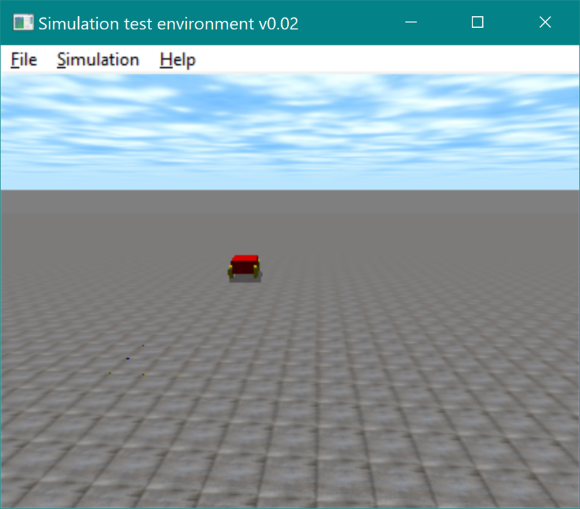

# ODECarSim
Car simulation using Open Dynamics Engine (ODE)

## Introduction
This project demonstrates how to using ODE to simulate simple ground vehicle.
The source code is in the **src** folder:
- VehicleLib: utility class for constructing 4-wheel ground vehicle. It supports
simplified linear suspension model as well as wishbone suspension model.
- SimpleCarApp: a demo project to simulate a vehicle with simplified linear
suspension.

## Dependency
- Open Dynamics Engine (ODE) version 0.15.2. See the [website](http://opende.sourceforge.net/wiki/index.php/Main_Page) for installation instruction.

## Installation
CMakeLists file is included in the project. So just run cmake to create the projects.

## Simulation
Currently, the vehicle will move forward in the simulation. The visualization can be turned on/off. The vehicle kinematic and dynamic data during the simulation will be logged and saved in a csv file.

